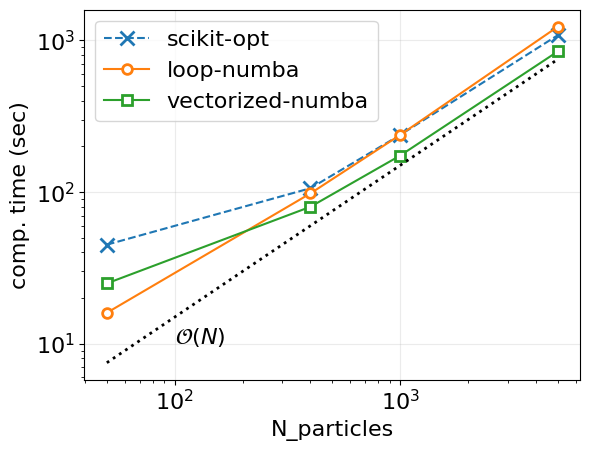

# PSO-GWO projects

This is a repository for a project to develop from scratch PSO-GWO 
(a hybrid of Particle Swarm Optimization and Grey Wolf Optimization) with 
detailed mathematical derivation and code translation to Python. We also plan to apply it to solve scheduling problem
We divide this project into several stages:
1. PSO
2. Hybrid PSO-GWO
3. Application to scheduling problem
4. API development

## PSO

In this first stage of this project, we explore first three different
implementations of PSO

1. vectorized-numba
2. loop-numba
3. scikit-opt

<table>
<tr>
<td>
  
<tr>
<td>
  The scaling plot of computational time to execute the program with different
  number of particles.
</table>

## Hybrid PSO-GWO

(on progress)

## Application to scheduling problem

(problem definition and desigining data structures)

## API

(coming soon)

